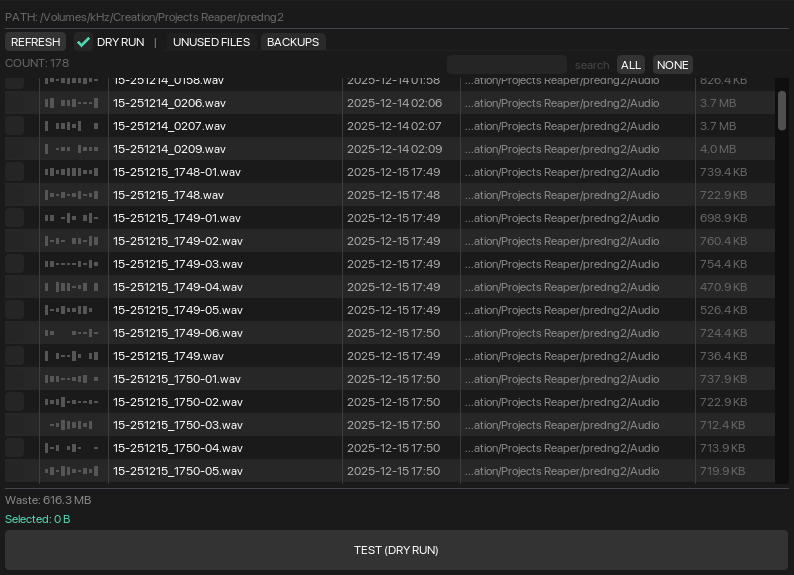
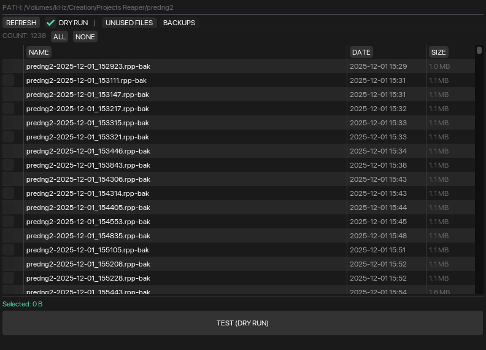

# Media & Backup Cleaner for REAPER

A project-aware cleanup tool for REAPER.  
Scans project folders for unused media files and project backups, helping you safely reclaim disk space.

---

## Features

- Detects unused media files in the project directory
- Scans project backup files (`.rpp-bak`)
- Dry Run mode (no files are deleted)
- Fast search and filtering
- Clear disk usage overview

---

## Installation

1. Download `MBCleaner.lua`
2. Copy it to: REAPER/Scripts/
3. In REAPER:
- Actions → Show action list
- ReaScript → Load
- Select `MBCleaner.lua`

---

## Usage

1. Open the script
2. Review unused files and backups
3. Disable **Dry Run**
4. Delete selected files

---

## Screenshots

---

## License

MIT
